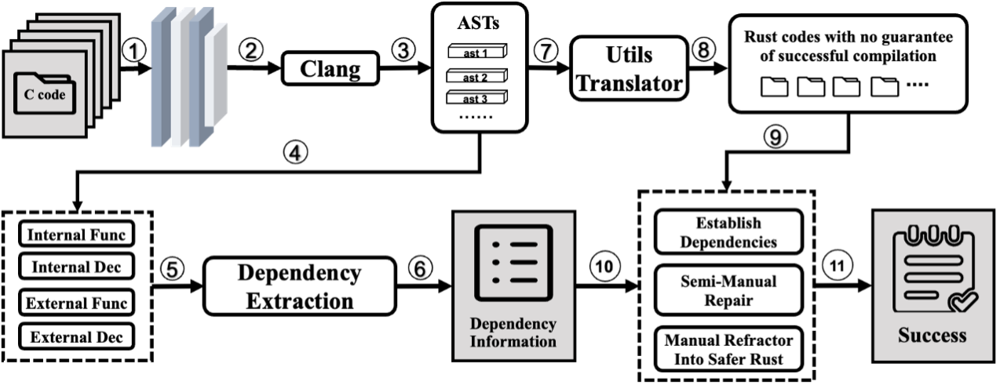

# Utils-Translator

Utils-Translator 是一个专注于C语言编写的基础命令行类型工具的Rust转译工具。

工具主要提供了自动化、可视化的依赖分析工具和自动化依赖构建工具，以增强原本C2Rust在基础命令行工具的转换上的能力。

以下是用C语言转换基础命令行工具为Rust的流程图：



## 安装

### 依赖

#### Rust

Utils-Translator 最好使用指定版本的Rust (nightly-2022-08-08)，可以通过以下命令安装：

```sh
curl --proto '=https' --tlsv1.2 -sSf https://sh.rustup.rs | sh -s -- --default-toolchain nightly-2022-08-08-x86_64-unknown-linux-gnu -y
```

#### 库

Utils-Translator 需要 LLVM 7 或更高版本，对应的 clang 编译器和库, Python 3.6 或更高版本, CMake 3.4.3 或更高版本, 以及 openssl (1.0)。这些依赖可以通过以下命令安装：

- **OpenEuler 22.03:**

    ```sh
    dnf group install -y "Development Tools"
    dnf install -y python cmake pkg-config grpc-devel grpc-plugins protobuf-devel c-ares-devel gtest-devel gmock-devel llvm-libs-12.0.1-2.oe2203 llvm-devel-12.0.1-2.oe2203 clang-devel
    ```

### 从git安装

```sh
cargo +nightly-2022-08-08-x86_64-unknown-linux-gnu --locked install --git https://github.com/licheam/utils-translator.git ec2rust deps-builder
```

如果遇到ast-exporter无法编译，可能是因为LLVM没有安装或者没有查询到LLVM路径，可以尝试如下命令。

```sh
export LLVM_LIB_DIR=`your_llvm_lib_dir`
```

在OpenEuler 22.03上，`your_llvm_lib_dir` 应当是 `/usr/lib64`。

## 文档

见 [docs](./docs/README.md)。

## Acknowledgements and Licensing

This material is available under the BSD-3 style license as found in the [LICENSE](./LICENSE) file.

The translator part of Utils-Translator is written based on the [C2Rust](github.com/immunant/c2rust) translator.
